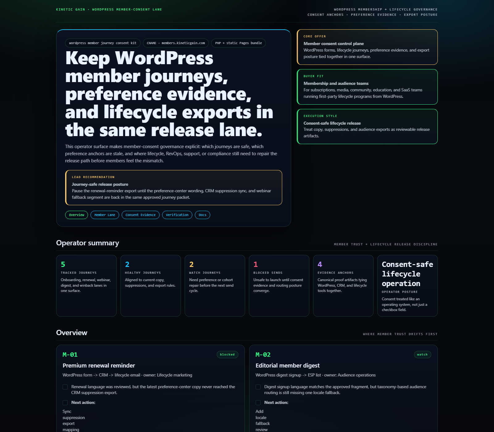
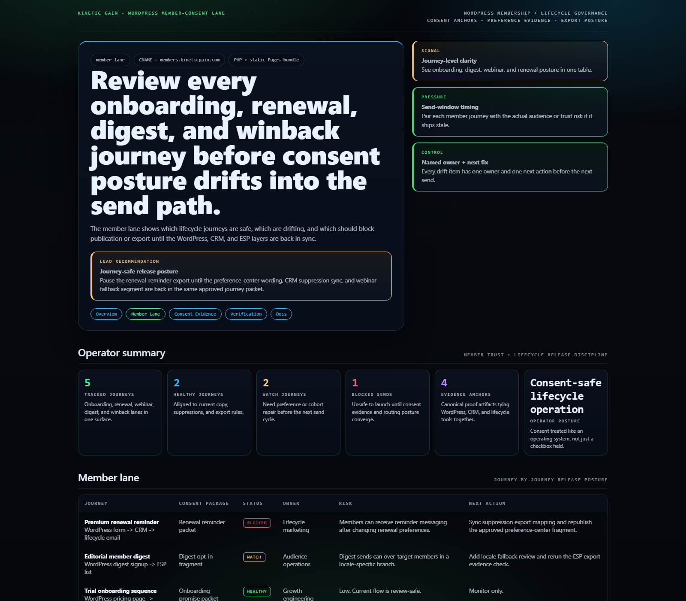
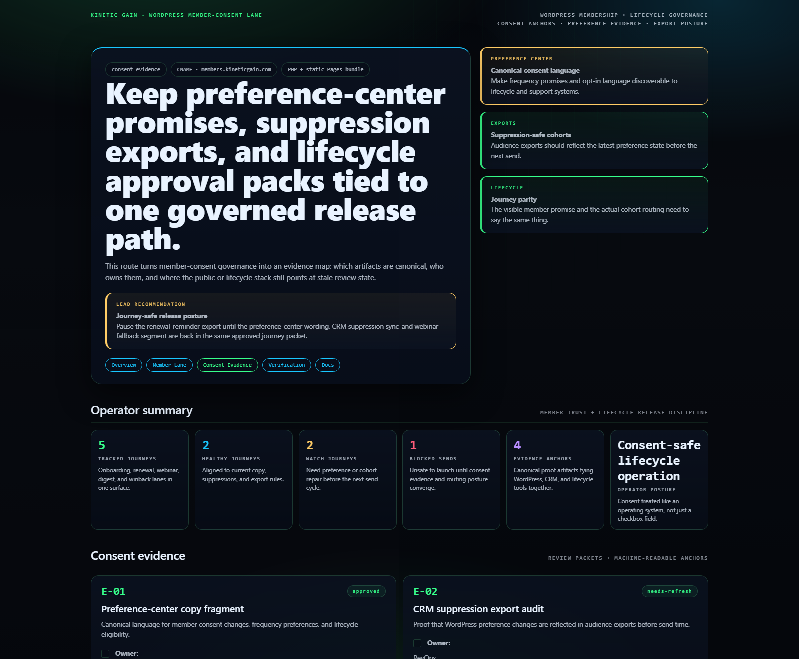
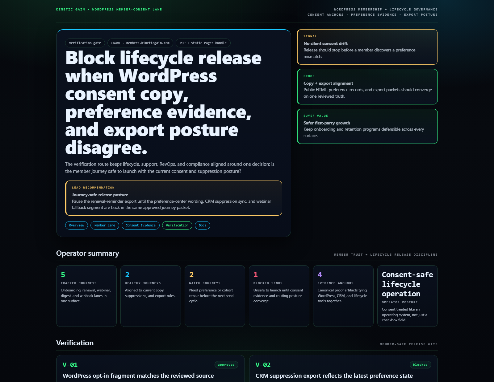

# WordPress Member Journey Consent Kit

WordPress control plane for member onboarding, lifecycle consent capture, preference evidence, and release-safe audience journey posture.

## Why this exists

- WordPress membership and newsletter estates usually split consent capture, copy ownership, CRM sync, and preference exports across too many tools.
- Lifecycle, growth, compliance, and support teams need one view of which member journeys are safe to send, which consent anchors are stale, and which exports are blocking release.
- Buyer-safe first-party growth requires the form, the preference center, and the audience export evidence to stay in the same reviewed lane.

## Why this matters (KG Embedded tie-back)

This repo demonstrates the member-consent primitive for Kinetic Gain Embedded: reviewed opt-in language, preference evidence, suppression-safe export posture, and lifecycle approval gates exposed through one operator surface. In a real embedded setting, the same primitive lets media, SaaS, community, and subscription teams keep acquisition, onboarding, retention, and consent records aligned without shipping lifecycle changes blindly.

## Routes

- `/`
- `/member-lane`
- `/consent-evidence`
- `/verification`
- `/docs`

## API

- `/api/dashboard/summary`
- `/api/member-lane`
- `/api/consent-evidence`
- `/api/verification`
- `/api/sample`

## Screenshots






## Local development

```powershell
cd wordpress-member-journey-consent-kit
php -S 127.0.0.1:5442 .\router.php
```

Open:
- [http://127.0.0.1:5442/](http://127.0.0.1:5442/)
- [http://127.0.0.1:5442/member-lane](http://127.0.0.1:5442/member-lane)
- [http://127.0.0.1:5442/consent-evidence](http://127.0.0.1:5442/consent-evidence)
- [http://127.0.0.1:5442/verification](http://127.0.0.1:5442/verification)

## Validation

- `php -l public\index.php`
- `php -l src\Services\MemberJourneyConsentKitService.php`
- `php -l src\Views\render.php`
- `php -l plugin\wordpress-member-journey-consent-kit.php`
- `php scripts\run_demo.php`
- `php scripts\prerender.php`
- `powershell -ExecutionPolicy Bypass -File .\scripts\smoke_check.ps1`
- `powershell -ExecutionPolicy Bypass -File .\scripts\render_readme_assets.ps1`

## Production status

| Aspect | Status |
|--------|--------|
| License | [AGPL-3.0-or-later](./LICENSE) |
| Security | [SECURITY.md](./SECURITY.md) |
| Deploy | Static prerender -> **https://members.kineticgain.com/** |
| WordPress primitive | Consent snapshot shortcode + REST route |

## Docs

- [Architecture](./docs/architecture.md)
- [Origin](./docs/ORIGIN.md)
- [Kinetic Gain Embedded tie-back](./docs/KINETIC_GAIN_EMBEDDED.md)
- [Changelog](./CHANGELOG.md)

## Part of the Kinetic Gain Suite

Operator surface in the [Kinetic Gain Suite](https://suite.kineticgain.com/) — a portfolio of buyer-readable control planes spanning compliance evidence, lifecycle governance, FinOps, identity posture, and operator workflows. Apex: [kineticgain.com](https://kineticgain.com/).
